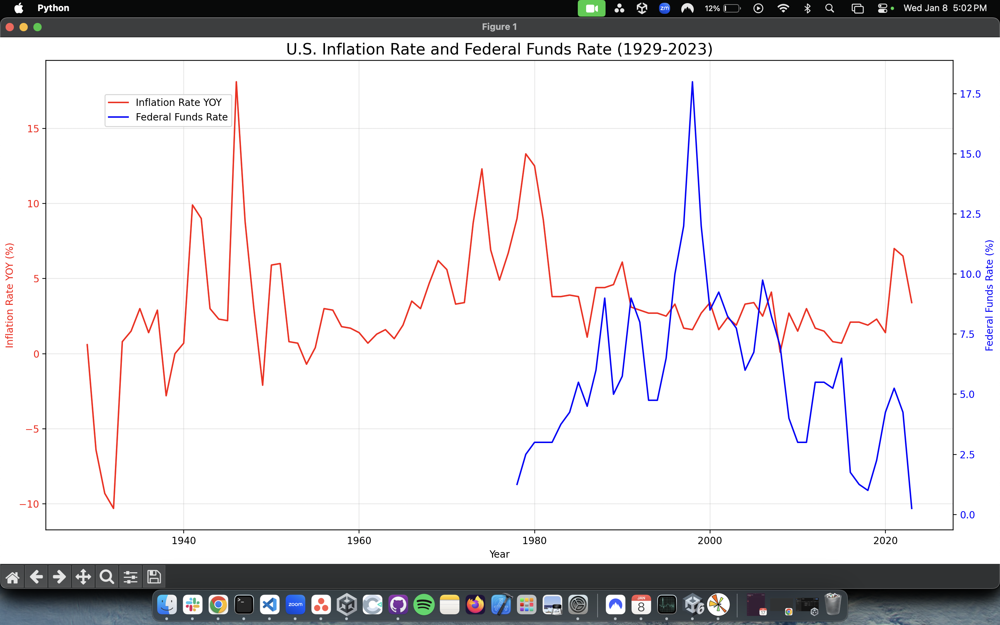

# U.S. Inflation Rate and Federal Funds Rate (1929-2023)

This project visualizes the relationship between the **U.S. Inflation Rate Year-Over-Year (YOY)** and the **Federal Funds Rate** over the years 1929–2023 using Python and Matplotlib.

## Features

- **Data Visualization**: The plot shows two key economic indicators:
  - **Inflation Rate YOY** (red line, primary y-axis)
  - **Federal Funds Rate** (blue line, secondary y-axis)
- **Interactive Graph**: The code dynamically handles data inconsistencies and adjusts the data for plotting.

## Requirements

- Python 3.x
- Libraries:
  - `pandas`
  - `matplotlib`

## Output

Below is the output of the script:

## Usage

1. Clone the repository:
    git clone https://github.com/Craig-HGP/2024-inflation-graph.git

2. Navigate to the project directory:
    cd 2024-inflation-graph

3. Install the required dependencies:
    pip install -r requirements.txt

4. Run the script:
    python inflation_script.py
